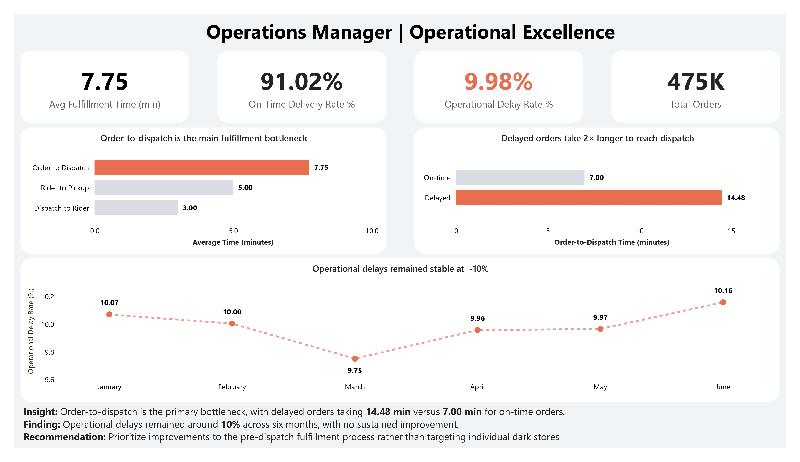
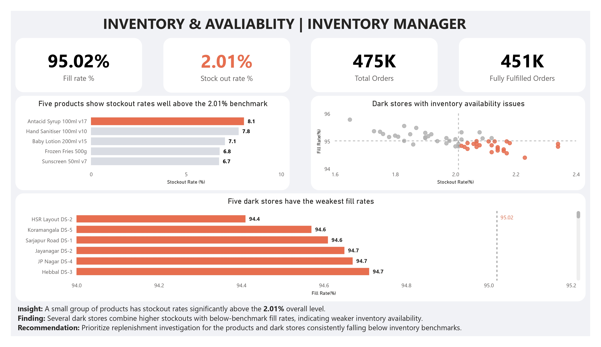
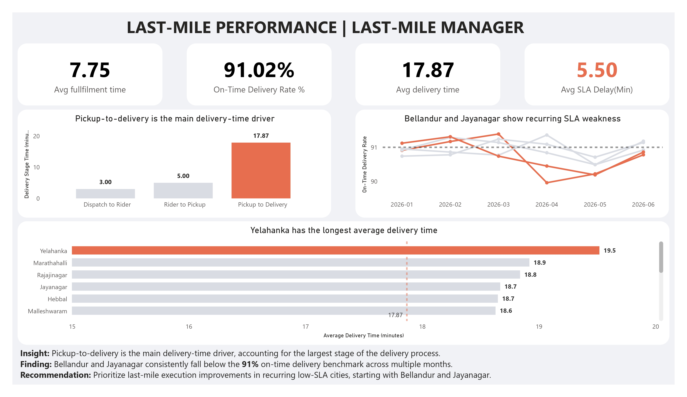
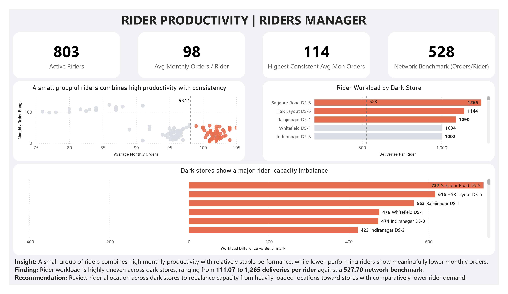

# Operational Excellence in Quick Commerce
> A business analytics case study focused on identifying operational bottlenecks, reducing delivery delays, and improving fulfillment efficiency in quick commerce.

## 📌 Business Problem

Quick-commerce businesses need to deliver orders quickly and reliably, but delays can occur due to **fulfillment bottlenecks, product stockouts, last-mile issues, and uneven rider allocation**.

These issues can delay orders, reduce fulfillment success, increase operating costs, and affect customer satisfaction.

The business needs to know **where these problems occur and which areas need attention first**.
## 🎯 Objective

Identify the main operational problems across **fulfillment, inventory, last-mile delivery, and rider operations** and provide clear findings to help managers improve delivery efficiency and fulfillment performance.

The analysis answers **10 business questions** across four operational teams.
## 👥 Stakeholders

| Stakeholder | Focus |
|---|---|
| **Operations Manager** | Fulfillment efficiency and delays |
| **Inventory Manager** | Stockouts and product availability |
| **Last-Mile Delivery Manager** | Delivery time and SLA performance |
| **Rider Operations Manager** | Rider productivity and allocation |

Each stakeholder has specific business questions that guide the analysis.
## 🔎 Business Questions

### Operations Manager
- **Q1.** [Which operational bottlenecks contribute the most to delayed order fulfillment?](sql/01_Operation_Manager/Q1.sql)
- **Q2.** [Which dark stores consistently underperform operationally based on fulfillment and delivery metrics?](sql/01_Operation_Manager/Q2.sql)
- **Q3.** [How has overall operational performance trended over time across key operational KPIs?](sql/01_Operation_Manager/Q3.sql)

### Inventory Manager
- **Q4.** [Which products experience the highest stockout rates?](sql/02_Iventory_Manager/Q4.sql)
- **Q5.** [Which dark stores have the lowest inventory availability, resulting in delayed or incomplete order fulfillment?](sql/02_Iventory_Manager/Q5.sql)

### Last-Mile Delivery Manager
- **Q6.** [What operational factors contribute most to delivery delays?](sql/03_Last-Mile_Manager/Q6.sql)
- **Q7.** [Which delivery zones consistently fail to meet the promised delivery SLA?](sql/03_Last-Mile_Manager/Q7.sql)
- **Q8.** [What is the average order fulfillment and delivery time across different locations and time periods?](sql/03_Last-Mile_Manager/Q8.sql)

### Rider Operations Manager
- **Q9.** [Which riders demonstrate consistently high or low operational performance?](sql/04_Rider_Manager/Q9.sql)
- **Q10.** [Are rider resources allocated efficiently across dark stores relative to delivery demand?](sql/04_Rider_Manager/Q10.sql)

## 🗂️ Dataset Overview

This case study uses a **synthetic quick-commerce operations dataset** created with Python.

The dataset was designed to behave like a real operational database using **business rules and relationships** across customers, dark stores, products, inventory, orders, order items, riders, and deliveries.

The data supports analysis across the complete order journey, from **order placement to final delivery**.
## 🛠️ Tools & Technologies

- **Python** — Dataset creation, analysis, and validation
- **SQL** — Business analysis using joins, CTEs, and window functions
- **Power BI** — Data modeling, DAX measures, and interactive dashboards
## 🔍 Analytical Approach

1. **Define** — Identify the operational problem, stakeholders, and 10 business questions.
2. **Measure** — Define KPIs that directly support each business question.
3. **Analyze** — Use SQL to investigate fulfillment, inventory, delivery, and rider performance.
4. **Identify** — Convert the analysis into clear business findings.
5. **Recommend** — Translate findings into specific operational actions.
6. **Visualize** — Present the findings through four stakeholder-focused Power BI dashboards.
## 📊 Key Findings

- **Fulfillment bottleneck:** Delayed orders take **14.48 minutes** to become dispatch-ready, compared with **7.00 minutes** for on-time orders. The overall operational delay rate is **9.98%**.

- **Inventory availability:** The overall stockout rate is **2.01%**, while **Antacid Syrup 100ml v17** has the highest stockout rate at **8.05%**.

- **Last-mile delays:** **Pickup-to-delivery** is the largest delivery stage at **24.45 minutes**, making it the main area to investigate for delivery delays.

- **SLA performance:** **Bellandur** and **Jayanagar** show recurring SLA weakness, with six-month average on-time delivery rates of **90.74%** and **90.78%** respectively.

- **Rider capacity:** Rider workload varies from **111.07 to 1,265 completed deliveries per rider**, compared with a network benchmark of **527.70**, showing a large imbalance in rider allocation.
## 💡 Business Recommendations

- **Improve the pre-dispatch fulfillment process** to reduce the gap between on-time and delayed orders and lower operational delays.

- **Prioritize replenishment for high-stockout products and problem stores** to improve inventory availability and reduce incomplete fulfillment.

- **Investigate pickup-to-delivery performance** in locations with recurring SLA issues to improve delivery reliability.

- **Review rider allocation across dark stores** and rebalance capacity where rider workload is significantly above or below the network benchmark.

## 📈 Power BI Dashboards

Four stakeholder-focused dashboards were created to communicate the analysis and support operational decision-making.

### 1. Operations Manager
Focus: **Fulfillment bottlenecks, operational delays, and performance trends**

### 2. Inventory Manager
Focus: **Stockout rates, fill rate, and inventory availability**

### 3. Last-Mile Delivery Manager
Focus: **Delivery delays, SLA performance, and delivery time**

### 4. Rider Operations Manager
Focus: **Rider productivity and capacity allocation across dark stores**

## 🔮 Future Improvements

- Add **real-time operational monitoring** to identify delays as they occur.
- Add **historical forecasting** to anticipate inventory stockouts and delivery demand.
- Analyze **peak-hour rider demand** to improve shift and capacity planning.
- Add **location-level root-cause analysis** for recurring SLA and delivery-time issues.
## 👤 Author

**Ashok Kumar N.**

[LinkedIn](https://www.linkedin.com/in/nmashokkumar/)
